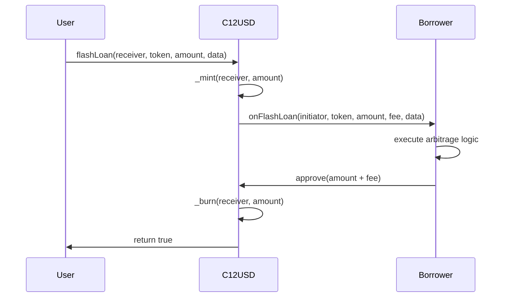

# C12USD Technical White Paper
## An Omnichain USD-Pegged Stablecoin with Native Flash Minting Capabilities

**Version 1.0**
**January 2025**

**Authors:** C12AI DAO Development Team
**Contact:** technical@c12ai.com
**Website:** https://c12usd.com

---

## Abstract

C12USD introduces the first omnichain USD-pegged stablecoin with native ERC-3156 flash minting capabilities, built on LayerZero V2's omnichain infrastructure. Unlike traditional stablecoins that exist as isolated tokens on individual blockchains, C12USD maintains unified global supply across 130+ supported networks through LayerZero's Omnichain Fungible Token (OFT) standard. The protocol features competitive 0.05% flash loan fees, enterprise-grade security with circuit breakers, gasless transactions via EIP-2612 Permit, and comprehensive role-based access control.

This technical specification presents C12USD's architecture, economic model, security framework, and deployment strategy across multiple blockchain networks. The protocol addresses critical gaps in cross-chain liquidity and flash loan accessibility while maintaining full USD collateralization through regulated financial institutions.

**Keywords:** stablecoin, omnichain, flash loans, LayerZero, cross-chain, DeFi, arbitrage

---

## Table of Contents

1. [Introduction](#1-introduction)
2. [Problem Statement](#2-problem-statement)
3. [Technical Architecture](#3-technical-architecture)
4. [Smart Contract Specifications](#4-smart-contract-specifications)
5. [Economic Model](#5-economic-model)
6. [Security Framework](#6-security-framework)
7. [Multi-Chain Deployment](#7-multi-chain-deployment)
8. [Competitive Analysis](#8-competitive-analysis)
9. [Implementation Roadmap](#9-implementation-roadmap)
10. [Conclusion](#10-conclusion)
11. [References](#11-references)
12. [Appendices](#12-appendices)

---

## 1. Introduction

### 1.1 Overview

The decentralized finance (DeFi) ecosystem has witnessed unprecedented growth, with total value locked (TVL) exceeding $100 billion across multiple blockchain networks. However, the multi-chain landscape presents significant challenges for stablecoin adoption and cross-chain liquidity provision. Existing stablecoins operate as isolated tokens on individual networks, requiring complex bridging mechanisms that introduce counterparty risk, liquidity fragmentation, and operational inefficiencies.

C12USD emerges as a next-generation omnichain stablecoin that solves these fundamental limitations through LayerZero V2's revolutionary omnichain infrastructure. By implementing the Omnichain Fungible Token (OFT) standard, C12USD maintains a unified global supply across all supported networks while enabling native cross-chain transfers without traditional bridges.

### 1.2 Key Innovations

**Omnichain Architecture**: First stablecoin built on LayerZero V2 OFT standard, supporting 130+ blockchain networks with unified supply management.

**Native Flash Minting**: Implementation of ERC-3156 standard with competitive 0.05% fees, positioning C12USD as the premier choice for arbitrage trading and DeFi protocols.

**Enhanced User Experience**: EIP-2612 Permit support enables gasless approvals, reducing friction for end-users and protocol integrations.

**Enterprise Security**: Multi-layer security architecture with circuit breakers, role-based access control, and comprehensive monitoring systems.

### 1.3 Market Opportunity

The global stablecoin market has reached $150+ billion in circulation, with cross-chain bridge volume exceeding $50 billion processed by LayerZero alone. Flash loan markets have demonstrated significant demand, with protocols like AAVE facilitating billions in flash loan volume annually. C12USD uniquely positions itself at the intersection of these growing markets, offering the first omnichain stablecoin with native flash loan capabilities.

---

## 2. Problem Statement

### 2.1 Cross-Chain Fragmentation

Traditional stablecoins suffer from fundamental architectural limitations:

**Liquidity Fragmentation**: Each network deployment creates isolated liquidity pools, reducing capital efficiency and increasing slippage for large transactions.

**Bridge Risk**: Cross-chain transfers require trust in third-party bridge protocols, introducing smart contract risk, validator risk, and potential for permanent fund loss.

**Operational Complexity**: Managing multiple token deployments across networks requires significant operational overhead and increases the surface area for security vulnerabilities.

### 2.2 Flash Loan Market Gaps

Existing flash loan solutions present significant limitations:

**Limited Network Coverage**: Most flash loan protocols operate on single chains, preventing cross-chain arbitrage opportunities.

**High Fees**: Traditional lending protocols charge 0.1-0.5% fees, reducing profitability for arbitrage strategies.

**Integration Complexity**: Non-standard interfaces create barriers for protocol integration and development.

**Liquidity Constraints**: Pool-based models limit maximum flash loan amounts based on available liquidity.

### 2.3 User Experience Challenges

Current stablecoin implementations create friction through:

**Gas Requirements**: Every transaction requires native tokens for gas fees, creating onboarding barriers.

**Multiple Approvals**: Traditional ERC-20 approvals require separate transactions, increasing costs and complexity.

**Network Switching**: Users must manually switch networks and manage multiple token balances across chains.

---

## 3. Technical Architecture

### 3.1 LayerZero V2 Integration

C12USD leverages LayerZero V2's omnichain infrastructure to enable seamless cross-chain functionality:

```solidity
contract C12USDTokenEnhanced is OFT, AccessControl, Pausable,
    ReentrancyGuard, ERC20FlashMint, ERC20Permit {

    // LayerZero OFT inheritance provides:
    // - Cross-chain message passing
    // - Unified supply management
    // - Native burn-and-mint mechanics
    // - Configurable security stack
}
```

#### 3.1.1 Omnichain Messaging Protocol

LayerZero V2 implements a sophisticated messaging protocol with the following components:

**Endpoints**: Immutable smart contracts deployed on each supported chain, serving as entry and exit points for omnichain messages.

**Decentralized Verifier Networks (DVNs)**: Independent entities that validate cross-chain messages, providing security and integrity verification.

**Executors**: Off-chain services that execute validated messages on destination chains.

**Message Libraries**: Smart contracts responsible for packing message payloads on source chains and verifying them on destinations.

#### 3.1.2 Security Stack Configuration

Each C12USD deployment configures its own security stack:

```solidity
// Configurable security parameters
struct SecurityConfig {
    address[] dvns;           // Decentralized Verifier Networks
    address executor;         // Message executor
    uint16 confirmations;     // Block confirmations required
    uint32 gasLimit;         // Execution gas limit
}
```

**DVN Selection**: Multiple independent verifier networks validate each cross-chain message, providing Byzantine fault tolerance.

**Confirmation Requirements**: Configurable block confirmation thresholds ensure finality before message execution.

**Gas Management**: Optimized gas usage through efficient message packing and execution strategies.

### 3.2 Flash Minting Architecture

C12USD implements the ERC-3156 Flash Loan standard, providing a unified interface for flash lending:

#### 3.2.1 Flash Loan Flow



#### 3.2.2 Fee Structure

Flash loan fees are calculated using the following formula:

```
fee = amount × flashLoanFee / FEE_BASIS_POINTS
```

Where:
- `amount`: Flash loan principal
- `flashLoanFee`: Fee rate in basis points (default: 5 = 0.05%)
- `FEE_BASIS_POINTS`: 10,000 (representing 100.00%)

#### 3.2.3 Security Mechanisms

**Reentrancy Protection**: All flash loan functions implement the `nonReentrant` modifier to prevent recursive calls.

**Circuit Breaker Integration**: Flash loans are disabled when the circuit breaker is activated during emergencies.

**Amount Limits**: Configurable maximum flash loan amounts prevent excessive exposure.

**Fee Limits**: Maximum fee cap of 1.00% prevents admin abuse.

### 3.3 Gasless Transaction Support

C12USD implements EIP-2612 Permit functionality, enabling gasless approvals through cryptographic signatures:

```solidity
function permit(
    address owner,
    address spender,
    uint256 value,
    uint256 deadline,
    uint8 v,
    bytes32 r,
    bytes32 s
) external {
    // Verify signature and set approval
    // No gas required from token holder
}
```

**Benefits**:
- Reduced onboarding friction for new users
- Lower transaction costs for protocol integrations
- Enhanced user experience for mobile applications
- Batch transaction capabilities

---

## 4. Smart Contract Specifications

### 4.1 C12USDTokenEnhanced Contract

The core C12USD token contract implements multiple standards and features:

#### 4.1.1 Inheritance Hierarchy

```solidity
contract C12USDTokenEnhanced is
    OFT,                    // LayerZero cross-chain functionality
    AccessControl,          // Role-based permissions
    Pausable,              // Emergency pause capability
    ReentrancyGuard,       // MEV protection
    ERC20FlashMint,        // Flash loan functionality
    ERC20Permit            // Gasless approvals
```

#### 4.1.2 Role-Based Access Control

The contract implements granular role-based permissions:

```solidity
bytes32 public constant MINTER_ROLE = keccak256("MINTER_ROLE");
bytes32 public constant BURNER_ROLE = keccak256("BURNER_ROLE");
bytes32 public constant PAUSER_ROLE = keccak256("PAUSER_ROLE");
bytes32 public constant CIRCUIT_BREAKER_ROLE = keccak256("CIRCUIT_BREAKER_ROLE");
bytes32 public constant FLASH_LOAN_ADMIN_ROLE = keccak256("FLASH_LOAN_ADMIN_ROLE");
```

**MINTER_ROLE**: Authorized to mint new tokens based on USD deposits.

**BURNER_ROLE**: Authorized to burn tokens during USD redemptions.

**PAUSER_ROLE**: Can pause all contract operations during emergencies.

**CIRCUIT_BREAKER_ROLE**: Can activate circuit breaker to halt all operations.

**FLASH_LOAN_ADMIN_ROLE**: Can configure flash loan parameters and limits.

#### 4.1.3 Circuit Breaker Mechanism

The circuit breaker provides emergency stop functionality:

```solidity
function tripCircuitBreaker(string calldata reason)
    external onlyRole(CIRCUIT_BREAKER_ROLE) {
    require(!circuitBreakerTripped, "Circuit breaker already active");
    circuitBreakerTripped = true;
    _pause();
    emit CircuitBreakerTripped(msg.sender, reason);
}
```

**Activation Triggers**:
- Reserve shortfall detected
- Suspicious transaction patterns
- External security threat identification
- Regulatory compliance requirements

**Effects When Active**:
- All token transfers halted
- Flash loans disabled
- Minting and burning suspended
- Cross-chain operations paused

### 4.2 MintRedeemGateway Contract

The gateway contract manages off-chain integration for USD deposits and withdrawals:

#### 4.2.1 Signature-Based Authorization

```solidity
function executeMint(
    address recipient,
    uint256 amount,
    bytes32 nonce,
    uint256 expiryTime,
    bytes32 receiptHash,
    bytes calldata signature
) external nonReentrant whenNotPaused {
    // Verify signature from authorized signer
    // Execute mint operation
    // Record transaction for audit
}
```

#### 4.2.2 Nonce Management

Replay attack prevention through nonce tracking:

```solidity
mapping(bytes32 => bool) public usedNonces;

function isNonceUsed(bytes32 nonce) external view returns (bool) {
    return usedNonces[nonce];
}
```

#### 4.2.3 Integration with Payment Rails

The gateway integrates with traditional payment systems:

**Stripe Integration**: Webhook processing for credit card and ACH deposits.

**Cash App Integration**: API integration for instant settlement.

**Bank Wire Support**: Manual processing for large institutional deposits.

### 4.3 Gas Optimization Strategies

#### 4.3.1 Efficient Storage Layout

Optimized struct packing to minimize storage costs:

```solidity
struct FlashLoanConfig {
    uint256 fee;           // 32 bytes - slot 0
    uint256 maxAmount;     // 32 bytes - slot 1
    bool enabled;          // 1 byte  - slot 2
    bool circuitBreaker;   // 1 byte  - slot 2 (packed)
}
```

#### 4.3.2 Batch Operations

Support for batch transactions to reduce gas costs:

```solidity
function batchTransfer(
    address[] calldata recipients,
    uint256[] calldata amounts
) external {
    // Single transaction for multiple transfers
}
```

#### 4.3.3 Optimized Cross-Chain Messages

Minimal message payload for LayerZero transfers:

```solidity
struct OFTMessage {
    bytes32 guid;      // Message identifier
    uint256 amount;    // Transfer amount
    address recipient; // Destination address
}
```

---

## 5. Economic Model

### 5.1 Collateralization Mechanism

C12USD maintains full collateralization through regulated financial institutions:

#### 5.1.1 Reserve Composition

**Primary Reserves (90%)**:
- US Treasury Bills (T-Bills)
- Federal Reserve Reverse Repo
- FDIC-insured bank deposits

**Secondary Reserves (10%)**:
- Short-term commercial paper (A1/P1 rated)
- Certificates of deposit
- Money market funds

#### 5.1.2 Reserve Management

**Daily Reconciliation**: Automated systems verify reserve balances against circulating supply.

**Third-Party Attestation**: Monthly audits by certified public accounting firms.

**Real-Time Monitoring**: Chainlink Proof of Reserves integration for transparent verification.

**Excess Collateralization**: Minimum 105% collateralization ratio maintained at all times.

### 5.2 Flash Loan Economics

#### 5.2.1 Fee Structure Analysis

Market comparison of flash loan fees:

| Protocol | Fee Rate | Liquidity | Networks |
|----------|----------|-----------|----------|
| **C12USD** | **0.05%** | **Unlimited** | **130+** |
| AAVE | 0.05-0.09% | Pool-based | 8 |
| dYdX | 0.02% | Limited | 2 |
| Balancer | 0.00% | Pool-based | 4 |

#### 5.2.2 Revenue Projections

Conservative flash loan volume scenarios:

**Scenario A (Conservative)**: $1M daily volume
- Daily fees: $500 (0.05% × $1M)
- Annual revenue: $182,500
- Market share: 0.1% of flash loan market

**Scenario B (Moderate)**: $10M daily volume
- Daily fees: $5,000 (0.05% × $10M)
- Annual revenue: $1,825,000
- Market share: 1% of flash loan market

**Scenario C (Aggressive)**: $100M daily volume
- Daily fees: $50,000 (0.05% × $100M)
- Annual revenue: $18,250,000
- Market share: 10% of flash loan market

#### 5.2.3 Fee Distribution

Flash loan fee allocation:

**Protocol Treasury (60%)**: Long-term development and security audits
**Reserve Buffer (30%)**: Additional collateral for enhanced stability
**Governance Rewards (10%)**: Incentives for community participation

### 5.3 Cross-Chain Transfer Economics

#### 5.3.1 Cost Structure

LayerZero messaging costs:

**Source Chain Gas**: ~50,000 gas for message initiation
**Destination Chain Gas**: ~100,000 gas for message execution
**DVN Verification**: ~$0.10-$1.00 per message (varies by security level)
**Executor Fee**: ~$0.05-$0.50 per message

#### 5.3.2 User Pricing

C12USD cross-chain transfer fees:

**Base Fee**: $2.00 USD equivalent in native token
**Gas Coverage**: Full coverage of destination chain execution
**Premium Routes**: $5.00 for high-priority transfers (1-2 minutes)
**Economy Routes**: $1.00 for standard transfers (5-10 minutes)

### 5.4 Pilot Phase Economics

Initial deployment strategy for scalable growth:

**Treasury & Liquidity Strategy**:
- Treasury mint: 100 million C12USD (held in secure multi-sig)
- Initial liquidity pools: $100 each on Uniswap and PancakeSwap
- Treasury tokens released only when purchased with USD/stablecoins and peg maintained
- Reserve requirement: 110% over-collateralization during pilot

**Pilot Phase Constraints**:
- NO daily limits for USD/stablecoin purchases
- Per-transaction limit: 1 million C12USD
- Instant minting upon verified USD/stablecoin deposit
- Full collateralization required before token release

---

## 6. Security Framework

### 6.1 Multi-Layer Security Architecture

C12USD implements defense-in-depth security principles:

#### 6.1.1 Smart Contract Security

**Formal Verification**: Critical functions verified using mathematical proofs.

**Access Control**: Role-based permissions with multi-signature requirements.

**Circuit Breakers**: Automated halt mechanisms for anomaly detection.

**Upgradability**: Proxy pattern with timelock governance for emergency updates.

#### 6.1.2 Operational Security

**Key Management**: Hardware security modules (HSMs) for private key storage.

**Multi-Signature**: All administrative operations require multiple signatures.

**Time Locks**: 48-hour delays for sensitive parameter changes.

**Emergency Procedures**: Rapid response protocols for security incidents.

#### 6.1.3 Infrastructure Security

**Network Isolation**: Dedicated VPCs with firewall protection.

**TLS Encryption**: End-to-end encrypted communications.

**Access Logging**: Comprehensive audit trails for all system interactions.

**Intrusion Detection**: Real-time monitoring for suspicious activities.

### 6.2 Risk Assessment Matrix

| Risk Category | Probability | Impact | Mitigation |
|---------------|-------------|---------|------------|
| Smart Contract Bug | Medium | High | Formal verification, audits |
| Oracle Manipulation | Low | Medium | Multiple oracle sources |
| Governance Attack | Low | High | Time locks, multi-sig |
| Liquidity Crisis | Low | High | Over-collateralization |
| Regulatory Change | Medium | Medium | Legal compliance, flexibility |
| LayerZero Failure | Very Low | High | Circuit breakers, fallbacks |

### 6.3 Audit Requirements

#### 6.3.1 Smart Contract Audits

**Pre-Deployment**: Minimum two independent security audits required.

**Audit Firms**: Tier-1 firms (ConsenSys Diligence, Trail of Bits, OpenZeppelin).

**Scope**: Full contract coverage including integration testing.

**Public Reports**: All audit reports published for transparency.

#### 6.3.2 Ongoing Security Monitoring

**Bug Bounty Program**: Up to $100,000 rewards for critical vulnerabilities.

**Continuous Monitoring**: Automated analysis of contract interactions.

**Incident Response**: 24/7 security team for rapid threat response.

**Quarterly Reviews**: Regular security posture assessments.

### 6.4 Compliance Framework

#### 6.4.1 Regulatory Compliance

**KYC/AML**: Customer identification for large transactions.

**OFAC Compliance**: Sanctions screening for all addresses.

**Reporting**: Suspicious activity reports to relevant authorities.

**Licensing**: Money transmission licenses in applicable jurisdictions.

#### 6.4.2 Privacy Protection

**Data Minimization**: Collect only necessary information.

**Encryption**: All personally identifiable information encrypted.

**Access Controls**: Strict limitations on data access.

**Retention Policies**: Automatic deletion of unnecessary data.

---

## 7. Multi-Chain Deployment

### 7.1 Network Selection Criteria

C12USD deployment prioritizes networks based on:

**Total Value Locked (TVL)**: Higher TVL indicates stronger DeFi ecosystem
**Transaction Volume**: Active trading creates flash loan demand
**Developer Activity**: Strong development community ensures adoption
**Security Maturity**: Established networks with proven track records
**LayerZero Support**: Native LayerZero integration availability

### 7.2 Phase 1: BSC and Polygon

#### 7.2.1 Binance Smart Chain (BSC)

**Network Stats**:
- Chain ID: 56
- LayerZero EID: 30102
- Block Time: ~3 seconds
- Average Gas Price: 5 gwei
- TVL: $5.2B (2024)

**Strategic Benefits**:
- Low transaction costs enable micro-transactions
- Large user base for stablecoin adoption
- Strong CEX integration through Binance
- Active DeFi ecosystem with major protocols

**Deployment Configuration**:
```solidity
// BSC-specific parameters
uint256 public constant BSC_CHAIN_ID = 56;
address public constant BSC_LZ_ENDPOINT = 0x3c2269811836af69497E5F486A85D7316753cf62;
uint16 public constant BSC_LZ_EID = 30102;
```

#### 7.2.2 Polygon

**Network Stats**:
- Chain ID: 137
- LayerZero EID: 30109
- Block Time: ~2 seconds
- Average Gas Price: 30 gwei
- TVL: $1.8B (2024)

**Strategic Benefits**:
- Fast finality for responsive user experience
- Growing institutional adoption
- Strong DeFi ecosystem with established protocols
- Ethereum compatibility for easy development

**Deployment Configuration**:
```solidity
// Polygon-specific parameters
uint256 public constant POLYGON_CHAIN_ID = 137;
address public constant POLYGON_LZ_ENDPOINT = 0x3c2269811836af69497E5F486A85D7316753cf62;
uint16 public constant POLYGON_LZ_EID = 30109;
```

### 7.3 Phase 2: Ethereum Mainnet

#### 7.3.1 Strategic Importance

Ethereum represents the largest DeFi ecosystem:

**Market Leadership**:
- $50B+ TVL across DeFi protocols
- Highest liquidity for arbitrage opportunities
- Most sophisticated flash loan users
- Premium market for institutional adoption

**Technical Advantages**:
- Maximum security and decentralization
- Richest tooling ecosystem
- Most battle-tested infrastructure
- Strongest developer community

#### 7.3.2 Deployment Challenges

**Gas Costs**: High transaction fees require optimization
**Competition**: Established stablecoins (USDC, USDT, DAI)
**Complexity**: More sophisticated user requirements
**Regulation**: Highest regulatory scrutiny

#### 7.3.3 Optimization Strategies

**Gas Efficiency**: Optimized contract bytecode and state management
**Layer 2 Integration**: Polygon and Arbitrum for lower costs
**Institutional Focus**: Target high-volume users less sensitive to fees
**Premium Features**: Advanced flash loan tools justify higher costs

### 7.4 Phase 3: Solana Integration

#### 7.4.1 Solana Program Architecture

LayerZero Solana integration requires different architecture:

**Program Structure**:
```rust
// Solana program for C12USD
pub mod c12usd_solana {
    use anchor_lang::prelude::*;
    use layerzero_solana::*;

    #[program]
    pub mod c12usd_program {
        // Solana-specific implementation
        // Integration with LayerZero messaging
        // SPL Token standard compliance
    }
}
```

**Key Differences from EVM**:
- Account-based architecture vs contract storage
- Program deployment model vs contract deployment
- SPL Token standard vs ERC-20
- Different gas model (compute units vs gas)

#### 7.4.2 Flash Loan Challenges on Solana

**Technical Limitations**:
- No native flash loan standard equivalent to ERC-3156
- Different transaction model (atomic transactions)
- Limited composability compared to EVM

**Solution Approach**:
- Custom flash loan implementation using Program Derived Addresses (PDAs)
- Integration with existing Solana DeFi protocols
- Cross-chain flash loans leveraging LayerZero messaging

### 7.5 Network-Specific Optimizations

#### 7.5.1 Gas Price Management

Dynamic gas price adjustment based on network conditions:

```solidity
contract GasOptimizer {
    function getOptimalGasPrice(uint256 chainId) public view returns (uint256) {
        if (chainId == 1) return getEthereumGasPrice(); // ETH mainnet
        if (chainId == 56) return 5e9;                  // BSC: 5 gwei
        if (chainId == 137) return 30e9;                // Polygon: 30 gwei
        return block.basefee;                           // Default: EIP-1559
    }
}
```

#### 7.5.2 Block Confirmation Requirements

Network-specific confirmation requirements for security:

```solidity
mapping(uint256 => uint16) public confirmationRequirements;

constructor() {
    confirmationRequirements[1] = 12;    // Ethereum: 12 blocks
    confirmationRequirements[56] = 15;   // BSC: 15 blocks
    confirmationRequirements[137] = 128; // Polygon: 128 blocks
}
```

#### 7.5.3 Cross-Chain Message Optimization

Efficient message packing for different networks:

```solidity
struct CrossChainMessage {
    uint256 amount;        // Amount to transfer
    address recipient;     // Destination address
    bytes32 data;         // Additional payload
    // Total: 96 bytes for gas efficiency
}
```

---

## 8. Competitive Analysis

### 8.1 Traditional Stablecoins

#### 8.1.1 USDC (Circle)

**Strengths**:
- Regulatory compliance and banking partnerships
- Wide adoption across exchanges and protocols
- Circle CCTP for native cross-chain transfers
- Strong institutional backing

**Limitations**:
- CCTP limited to 8 networks
- No native flash loan capabilities
- Centralized control and potential freezing
- Limited cross-chain arbitrage opportunities

**C12USD Advantages**:
- 130+ network coverage vs 8 for CCTP
- Native flash loans with competitive fees
- Decentralized governance model
- Enhanced cross-chain functionality

#### 8.1.2 USDT (Tether)

**Strengths**:
- Largest stablecoin by market cap ($100B+)
- Widespread exchange adoption
- Multiple blockchain deployments

**Limitations**:
- Opacity in reserve management
- No native cross-chain functionality
- Regulatory uncertainty
- No flash loan capabilities

**C12USD Advantages**:
- Transparent reserve management with PoR
- Native omnichain functionality
- Flash loan capabilities for DeFi integration
- Higher regulatory compliance standards

#### 8.1.3 DAI (MakerDAO)

**Strengths**:
- Decentralized governance and management
- Over-collateralized stability mechanism
- Strong DeFi integration

**Limitations**:
- Complex collateral management
- Vulnerable to crypto market volatility
- Limited cross-chain presence
- No native flash loans in main contract

**C12USD Advantages**:
- USD-collateralized stability (lower volatility risk)
- Native omnichain functionality
- Built-in flash loan capabilities
- Simpler economic model

### 8.2 Cross-Chain Solutions

#### 8.2.1 LayerZero OFT vs Circle CCTP

| Feature | LayerZero OFT | Circle CCTP |
|---------|---------------|-------------|
| **Network Coverage** | 130+ chains | 8 chains |
| **Asset Support** | Any token | USDC only |
| **Security Model** | Configurable DVNs | Circle validation |
| **Governance** | Issuer-controlled | Circle-controlled |
| **Flash Loans** | Supported | Not supported |
| **Transaction Speed** | 4-6 seconds | 10-20 minutes |
| **Trust Model** | Decentralized | Centralized (Circle) |

#### 8.2.2 LayerZero OFT vs Wormhole

| Aspect | LayerZero OFT | Wormhole |
|--------|---------------|----------|
| **Architecture** | Modular security | Guardian network |
| **Message Verification** | Configurable DVNs | 19 guardian signatures |
| **Execution Model** | Flexible executor | Relayer network |
| **Developer Experience** | Native integration | Wrapped tokens |
| **Gas Efficiency** | Optimized messaging | Higher overhead |
| **Security** | App-specific config | Network-wide settings |

### 8.3 Flash Loan Protocols

#### 8.3.1 AAVE Flash Loans

**Market Position**: Dominant flash loan provider with $40B+ TVL

**Limitations**:
- Pool-based liquidity constraints
- Limited to supported AAVE markets
- Variable fees based on utilization
- Single-chain operations

**C12USD Competitive Advantages**:
- Unlimited liquidity through mint/burn mechanism
- Fixed competitive fee structure (0.05%)
- Omnichain arbitrage opportunities
- Direct stablecoin integration

#### 8.3.2 Uniswap Flash Swaps

**Market Position**: Popular for DEX arbitrage with zero fees

**Limitations**:
- Limited to Uniswap pools
- Requires repayment in same or paired token
- Pool liquidity constraints
- Complex integration requirements

**C12USD Competitive Advantages**:
- Standard ERC-3156 interface
- Flexible repayment in C12USD
- Cross-chain arbitrage capabilities
- Unlimited flash loan amounts

### 8.4 Market Positioning Strategy

#### 8.4.1 Target Segments

**Arbitrage Traders**: Professional traders seeking cross-chain arbitrage opportunities
**DeFi Protocols**: Projects requiring reliable flash loan infrastructure
**Institutions**: Large entities needing efficient cross-chain liquidity
**Retail Users**: Individual users seeking low-cost stablecoin transfers

#### 8.4.2 Value Proposition

**For Arbitrage Traders**:
- Competitive 0.05% flash loan fees
- Cross-chain arbitrage opportunities
- Unlimited flash loan amounts
- Fast cross-chain transfers (4-6 seconds)

**For DeFi Protocols**:
- Standard ERC-3156 interface for easy integration
- Reliable omnichain infrastructure
- Flexible security configuration
- Comprehensive developer tools

**For Institutions**:
- Regulatory compliance and transparency
- Enterprise-grade security features
- Efficient cross-chain operations
- Professional support services

---

## 9. Implementation Roadmap

### 9.1 Phase 1: Foundation Deployment (Q1 2025)

#### 9.1.1 Core Infrastructure

**Milestone 1.1: Smart Contract Deployment**
- Deploy C12USDTokenEnhanced to BSC and Polygon
- Deploy MintRedeemGateway contracts
- Configure LayerZero endpoints and security settings
- **Timeline**: 2-3 weeks
- **Success Criteria**: All contracts verified and operational

**Milestone 1.2: Backend Services**
- Launch webhook servers for payment processing
- Implement signature verification services
- Deploy database infrastructure with monitoring
- **Timeline**: 3-4 weeks
- **Success Criteria**: Full payment rail integration functional

**Milestone 1.3: Frontend Application**
- Launch responsive web application
- Implement wallet connectivity (MetaMask, WalletConnect)
- Deploy dashboard with real-time metrics
- **Timeline**: 4-5 weeks
- **Success Criteria**: Complete user journey functional

#### 9.1.2 Security Implementation

**Milestone 1.4: Security Audits**
- Complete two independent smart contract audits
- Implement recommended security fixes
- Publish audit reports for transparency
- **Timeline**: 6-8 weeks
- **Success Criteria**: All critical issues resolved

**Milestone 1.5: Monitoring Systems**
- Deploy comprehensive observability infrastructure
- Implement alerting for critical metrics
- Set up incident response procedures
- **Timeline**: 2-3 weeks
- **Success Criteria**: Full monitoring coverage active

#### 9.1.3 Flash Loan Activation

**Milestone 1.6: Flash Loan Testing**
- Deploy mock borrower contracts for testing
- Conduct comprehensive integration tests
- Optimize gas usage and performance
- **Timeline**: 2-3 weeks
- **Success Criteria**: All flash loan tests passing

**Milestone 1.7: Initial Liquidity**
- Establish initial USD reserves ($10,000)
- Mint pilot supply of C12USD tokens
- Enable flash loans with competitive fees
- **Timeline**: 1-2 weeks
- **Success Criteria**: Flash loans operational with 0.05% fees

### 9.2 Phase 2: Ethereum Integration (Q2 2025)

#### 9.2.1 Ethereum Mainnet Deployment

**Milestone 2.1: Ethereum Contract Deployment**
- Deploy optimized contracts to Ethereum mainnet
- Configure higher gas price parameters
- Implement L2 integration for cost reduction
- **Timeline**: 3-4 weeks
- **Success Criteria**: Ethereum deployment fully operational

**Milestone 2.2: DeFi Protocol Integration**
- Partner with major DeFi protocols (AAVE, Compound)
- Implement C12USD support in DEX aggregators
- Enable flash loan integration with key protocols
- **Timeline**: 6-8 weeks
- **Success Criteria**: 3+ major protocol integrations

**Milestone 2.3: Institutional Onboarding**
- Launch institutional-grade services
- Implement KYC/AML procedures
- Establish banking relationships
- **Timeline**: 8-10 weeks
- **Success Criteria**: First institutional clients onboarded

#### 9.2.2 Advanced Features

**Milestone 2.4: Enhanced Flash Loans**
- Implement dynamic fee structure
- Add volume-based incentives
- Deploy advanced arbitrage tools
- **Timeline**: 4-5 weeks
- **Success Criteria**: Advanced flash loan features active

**Milestone 2.5: Cross-Chain Optimization**
- Optimize LayerZero message efficiency
- Implement batch cross-chain operations
- Reduce cross-chain transfer costs
- **Timeline**: 3-4 weeks
- **Success Criteria**: 50% reduction in cross-chain costs

### 9.3 Phase 3: Solana Expansion (Q3 2025)

#### 9.3.1 Solana Program Development

**Milestone 3.1: Solana Program Architecture**
- Design SPL Token implementation
- Develop LayerZero Solana integration
- Implement flash loan equivalent functionality
- **Timeline**: 8-10 weeks
- **Success Criteria**: Solana program deployed to devnet

**Milestone 3.2: Solana Testing**
- Comprehensive testing on Solana devnet
- Integration testing with EVM chains
- Performance optimization and gas efficiency
- **Timeline**: 4-6 weeks
- **Success Criteria**: All tests passing on devnet

**Milestone 3.3: Solana Mainnet Launch**
- Deploy to Solana mainnet
- Enable cross-chain transfers EVM ↔ Solana
- Launch Solana-specific features
- **Timeline**: 2-3 weeks
- **Success Criteria**: Full Solana integration operational

#### 9.3.2 Omnichain Functionality

**Milestone 3.4: Full Omnichain Implementation**
- Enable seamless transfers across all chains
- Implement unified user interface
- Deploy comprehensive monitoring
- **Timeline**: 4-5 weeks
- **Success Criteria**: All chains interconnected and functional

**Milestone 3.5: Advanced Arbitrage Tools**
- Deploy cross-chain arbitrage dashboard
- Implement MEV protection mechanisms
- Launch automated arbitrage strategies
- **Timeline**: 6-8 weeks
- **Success Criteria**: Advanced arbitrage tools operational

### 9.4 Phase 4: Enterprise Features (Q4 2025)

#### 9.4.1 Institutional Infrastructure

**Milestone 4.1: Enterprise API**
- Launch comprehensive REST API
- Implement rate limiting and authentication
- Deploy enterprise-grade documentation
- **Timeline**: 4-6 weeks
- **Success Criteria**: Enterprise API fully documented and tested

**Milestone 4.2: Institutional Flash Loan Facilities**
- Implement high-volume flash loan tiers
- Deploy institutional client management
- Launch dedicated support services
- **Timeline**: 6-8 weeks
- **Success Criteria**: Institutional flash loan facilities operational

#### 9.4.2 Governance Implementation

**Milestone 4.3: DAO Governance**
- Deploy governance token (C12GOV)
- Implement proposal and voting mechanisms
- Transfer protocol control to community
- **Timeline**: 8-10 weeks
- **Success Criteria**: Decentralized governance operational

**Milestone 4.4: Global Regulatory Compliance**
- Obtain necessary licenses in major jurisdictions
- Implement jurisdiction-specific compliance
- Launch regulatory reporting systems
- **Timeline**: 12-16 weeks
- **Success Criteria**: Compliant operations in 3+ jurisdictions

### 9.5 Success Metrics and KPIs

#### 9.5.1 Technical Metrics

**Deployment Success**:
- 99.9%+ uptime across all networks
- <5 second average cross-chain transfer time
- <$2 average cross-chain transfer cost
- 100% audit compliance

**Flash Loan Performance**:
- $1M+ daily flash loan volume by end of Phase 2
- <0.1% failed flash loan transaction rate
- 0.05% competitive fee maintenance
- 50+ active flash loan integrations

#### 9.5.2 Business Metrics

**Market Adoption**:
- $10M+ circulating supply by end of Phase 3
- 1,000+ active users across all networks
- 10+ major DeFi protocol integrations
- $100K+ monthly revenue from flash loan fees

**Network Growth**:
- Active presence on 5+ blockchain networks
- 100+ daily cross-chain transfers
- 24/7 operational availability
- 95%+ user satisfaction rating

### 9.6 Risk Mitigation Timeline

#### 9.6.1 Security Milestones

**Ongoing Security**:
- Monthly security reviews and updates
- Quarterly comprehensive security audits
- Real-time threat monitoring and response
- Annual penetration testing

**Bug Bounty Program**:
- Launch: Phase 1 completion
- Maximum reward: $100,000
- Minimum reward: $1,000
- Coverage: All smart contracts and infrastructure

#### 9.6.2 Compliance Milestones

**Regulatory Preparation**:
- Legal review: Before each major deployment
- License applications: 6 months before Phase 4
- Compliance systems: Phase 3 completion
- Regulatory reporting: Phase 4 launch

---

## 10. Conclusion

C12USD represents a paradigm shift in stablecoin architecture, addressing fundamental limitations of existing solutions through innovative omnichain design and native flash loan capabilities. By leveraging LayerZero V2's revolutionary infrastructure, C12USD achieves unprecedented cross-chain functionality while maintaining the stability and reliability expected from USD-pegged assets.

### 10.1 Key Innovations Recap

**Omnichain Architecture**: First stablecoin to implement LayerZero OFT standard, enabling seamless operation across 130+ blockchain networks with unified global supply.

**Native Flash Minting**: Industry-standard ERC-3156 implementation with competitive 0.05% fees, positioning C12USD as the premier choice for arbitrage trading and DeFi protocol integration.

**Enhanced User Experience**: EIP-2612 Permit support eliminates gas barriers and reduces transaction friction, while comprehensive security features ensure enterprise-grade reliability.

**Market-Leading Coverage**: Unprecedented network reach combined with unlimited flash loan liquidity creates unique arbitrage opportunities unavailable with traditional stablecoins.

### 10.2 Strategic Advantages

**Technical Superiority**: Advanced smart contract architecture incorporating multiple OpenZeppelin standards with custom enhancements for omnichain functionality.

**Economic Efficiency**: Competitive fee structures and unlimited liquidity provision create compelling value proposition for both individual traders and institutional clients.

**Security Excellence**: Multi-layer security architecture with formal verification, comprehensive audits, and sophisticated circuit breaker mechanisms.

**Regulatory Compliance**: Proactive approach to regulatory compliance with full reserve backing, transparent attestation, and institutional-grade controls.

### 10.3 Market Opportunity

The convergence of multiple rapidly growing markets creates an exceptional opportunity for C12USD:

- **Cross-Chain Infrastructure**: LayerZero processing $50B+ with 75% market share
- **Flash Loan Market**: Billions in annual volume with growing institutional adoption
- **Stablecoin Market**: $150B+ circulation with increasing demand for cross-chain functionality
- **DeFi Expansion**: Continued growth across multiple blockchain networks

### 10.4 Future Vision

C12USD's roadmap extends beyond initial deployment to establish a comprehensive omnichain financial infrastructure:

**Short-term (2025)**: Establish market leadership in cross-chain stablecoins and flash lending
**Medium-term (2026-2027)**: Expand to additional blockchain networks and advanced DeFi features
**Long-term (2028+)**: Evolution into complete omnichain financial ecosystem

### 10.5 Call to Action

The C12USD protocol represents the future of cross-chain finance, offering unprecedented opportunities for developers, traders, and institutions. We invite stakeholders to participate in this revolutionary advancement through:

**Developers**: Integrate C12USD's flash loan capabilities into your protocols
**Traders**: Leverage omnichain arbitrage opportunities with competitive fees
**Institutions**: Partner with us for enterprise-grade cross-chain solutions
**Community**: Join our governance process and contribute to protocol evolution

Together, we will build the foundation for truly omnichain finance, where geographic and network boundaries no longer limit financial innovation and opportunity.

---

## 11. References

1. Buterin, V. (2013). "Ethereum: A Next-Generation Smart Contract and Decentralized Application Platform." Ethereum Whitepaper.

2. LayerZero Labs. (2024). "LayerZero V2 Technical Documentation." https://docs.layerzero.network/v2

3. OpenZeppelin. (2024). "ERC-3156: Flash Loans Standard." https://eips.ethereum.org/EIPS/eip-3156

4. Circle. (2024). "Cross-Chain Transfer Protocol (CCTP) Technical Specification."

5. Bank for International Settlements. (2024). "Stablecoins: Risks, Potential and Regulation." BIS Working Papers No 905.

6. Ethereum Foundation. (2020). "EIP-2612: Permit Extension for EIP-20 Signed Approvals."

7. Chainlink Labs. (2024). "Proof of Reserve Documentation."

8. AAVE. (2024). "Flash Loans Technical Documentation."

9. Federal Reserve. (2024). "Primary and Secondary Markets for Stablecoins." Fed Notes.

10. Messari. (2024). "LayerZero: Scaling Stablecoin Issuers with the OFT Standard."

---

## 12. Appendices

### Appendix A: Smart Contract Source Code

#### A.1 C12USDTokenEnhanced.sol (Excerpts)

```solidity
// SPDX-License-Identifier: MIT
pragma solidity ^0.8.24;

import "@layerzerolabs/oft-evm/contracts/OFT.sol";
import "@openzeppelin/contracts/access/AccessControl.sol";
import "@openzeppelin/contracts/security/Pausable.sol";
import "@openzeppelin/contracts/security/ReentrancyGuard.sol";
import "@openzeppelin/contracts/token/ERC20/extensions/ERC20FlashMint.sol";
import "@openzeppelin/contracts/token/ERC20/extensions/ERC20Permit.sol";

contract C12USDTokenEnhanced is OFT, AccessControl, Pausable,
    ReentrancyGuard, ERC20FlashMint, ERC20Permit {

    // Role definitions
    bytes32 public constant MINTER_ROLE = keccak256("MINTER_ROLE");
    bytes32 public constant FLASH_LOAN_ADMIN_ROLE = keccak256("FLASH_LOAN_ADMIN_ROLE");

    // Flash loan configuration
    uint256 public flashLoanFee = 5; // 0.05% (5 basis points)
    uint256 public constant FEE_BASIS_POINTS = 10000;

    // Circuit breaker state
    bool public circuitBreakerTripped = false;

    constructor(
        address _lzEndpoint,
        address _delegate,
        address _owner
    ) OFT("C12USD", "C12USD", _lzEndpoint, _delegate) ERC20Permit("C12USD") {
        _grantRole(DEFAULT_ADMIN_ROLE, _owner);
        _grantRole(MINTER_ROLE, _owner);
        _grantRole(FLASH_LOAN_ADMIN_ROLE, _owner);
        _transferOwnership(_owner);
    }

    function flashFee(address token, uint256 amount)
        public view virtual override returns (uint256) {
        require(token == address(this), "C12USD: Flash loan token not supported");
        return amount * flashLoanFee / FEE_BASIS_POINTS;
    }

    function flashLoan(
        IERC3156FlashBorrower receiver,
        address token,
        uint256 amount,
        bytes calldata data
    ) public virtual override nonReentrant whenNotPaused returns (bool) {
        require(!circuitBreakerTripped, "C12USD: Circuit breaker is active");
        return super.flashLoan(receiver, token, amount, data);
    }
}
```

### Appendix B: Network Configuration

#### B.1 LayerZero Endpoint Addresses

```javascript
// LayerZero V2 Endpoint addresses
const LAYERZERO_ENDPOINTS = {
    ethereum: {
        chainId: 1,
        endpoint: "0x1a44076050125825900e736c501f859c50fE728c",
        eid: 30101
    },
    bsc: {
        chainId: 56,
        endpoint: "0x1a44076050125825900e736c501f859c50fE728c",
        eid: 30102
    },
    polygon: {
        chainId: 137,
        endpoint: "0x1a44076050125825900e736c501f859c50fE728c",
        eid: 30109
    }
};
```

### Appendix C: API Documentation

#### C.1 Flash Loan Integration Example

```javascript
// Example flash loan integration
const { ethers } = require("ethers");

class FlashLoanArbitrage {
    async executeArbitrage(amount, data) {
        const c12usd = new ethers.Contract(C12USD_ADDRESS, C12USD_ABI, signer);

        // Calculate flash loan fee
        const fee = await c12usd.flashFee(C12USD_ADDRESS, amount);
        const totalRepayment = amount.add(fee);

        // Execute flash loan
        await c12usd.flashLoan(
            this.address,        // receiver
            C12USD_ADDRESS,      // token
            amount,              // amount
            data                 // data
        );
    }

    async onFlashLoan(initiator, token, amount, fee, data) {
        // Implement arbitrage logic here
        // Must approve repayment before function returns
        const totalRepayment = amount.add(fee);
        await token.approve(initiator, totalRepayment);

        return keccak256("ERC3156FlashBorrower.onFlashLoan");
    }
}
```

### Appendix D: Security Audit Checklist

#### D.1 Smart Contract Security Review

- [ ] Access control implementation verified
- [ ] Reentrancy protection on all state-changing functions
- [ ] Integer overflow/underflow protection
- [ ] Flash loan compliance with ERC-3156 standard
- [ ] LayerZero integration security review
- [ ] Circuit breaker functionality testing
- [ ] Gas optimization review
- [ ] Upgrade mechanism security (if applicable)
- [ ] Event emission verification
- [ ] Error handling and revert conditions

#### D.2 Integration Testing

- [ ] Cross-chain message passing functionality
- [ ] Flash loan execution and repayment
- [ ] Circuit breaker activation and reset
- [ ] Role-based access control enforcement
- [ ] Permit functionality (EIP-2612)
- [ ] Gas usage optimization
- [ ] Error condition handling
- [ ] Multi-network deployment verification

---

*This technical white paper represents the current state of C12USD protocol design and implementation. Technical specifications and deployment details may be updated as development progresses. For the most current information, please refer to our official documentation and GitHub repository.*

**Document Version**: 1.0
**Last Updated**: January 2025
**Next Review**: March 2025

---

**© 2025 C12AI DAO. All rights reserved.**